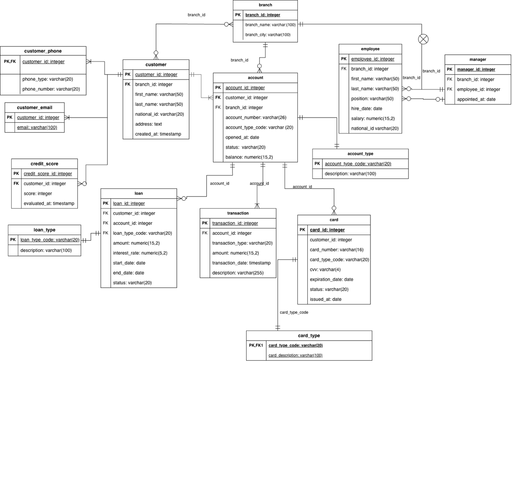
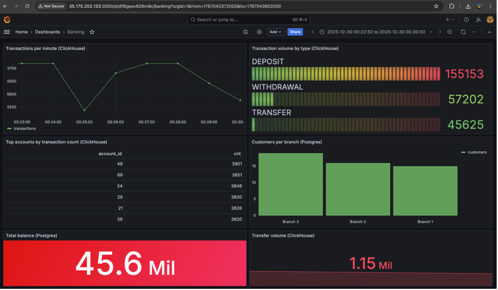
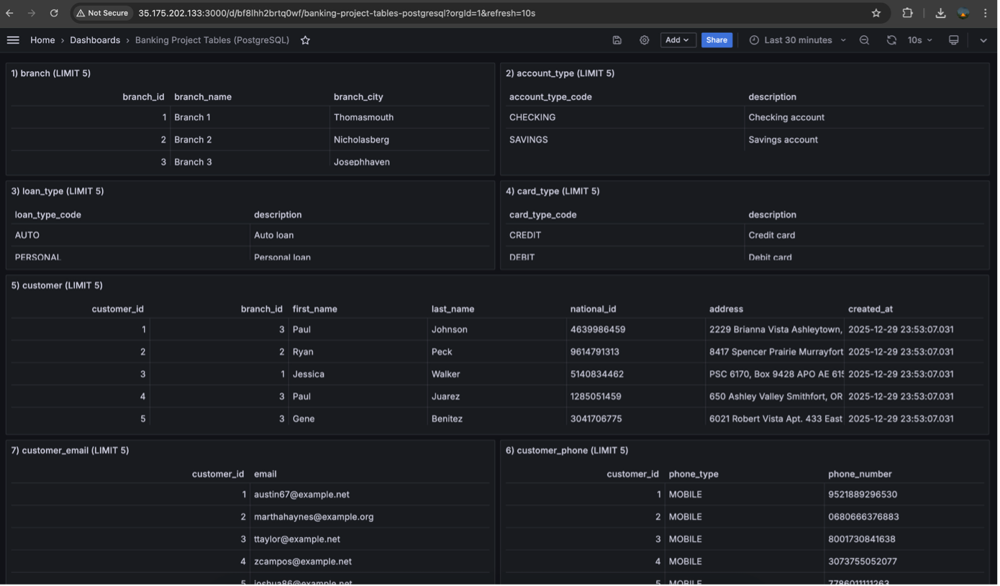
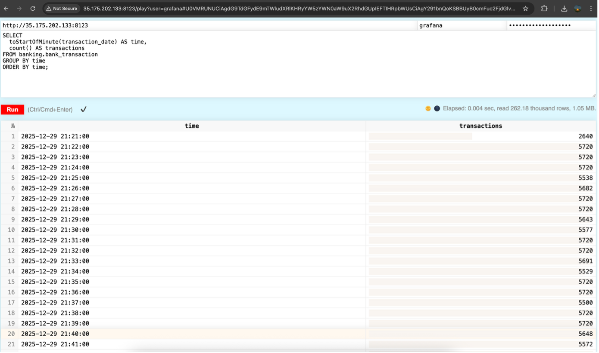
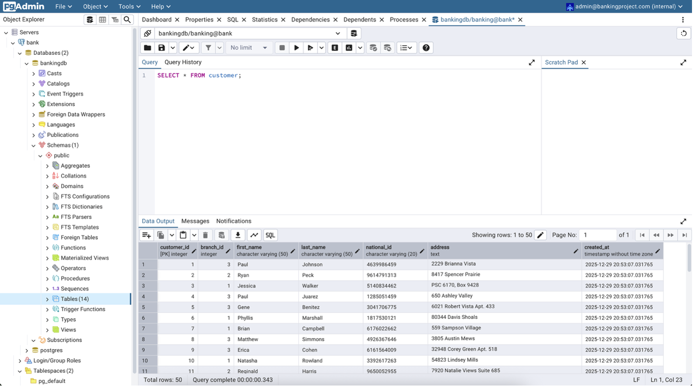

# 🏦 Banking Database Management System

### MIS 3301 – Database Management Systems · Term Project


A full-stack banking information system featuring a normalized relational schema, OLTP/OLAP separation, automated transaction generation, and real-time Grafana dashboards — fully containerized with Docker Compose and deployed live on **AWS EC2**.

---

## 📐 System Architecture

```
+------------------------------------------------------+
|                    Docker Compose                    |
|                                                      |
|  +--------------+  writes   +--------------------+   |
|  |  Generator   | --------> |   PostgreSQL 16    |   |
|  |  (Python)    |           |      (OLTP)        |<--+-- pgAdmin
|  |              | --------> |                    |   |
|  +--------------+  mirrors  +--------------------+   |
|                      |                               |
|                      v                               |
|               +-------------+                        |
|               |  ClickHouse |                        |
|               |   (OLAP)    |                        |
|               +------+------+                        |
|                      |       +---------------------+ |
|  PostgreSQL ---------+-----> |  Grafana Dashboards | |
|                              +---------------------+ |
+------------------------------------------------------+
```

| Component | Technology | Role |
|---|---|---|
| **PostgreSQL 16** | OLTP Database | System of record — constraints, triggers, FK integrity |
| **ClickHouse 24.8** | OLAP Database | High-speed analytics on mirrored transaction data |
| **Grafana 11.2** | Visualization | Dashboards sourced from both PostgreSQL and ClickHouse |
| **Python Generator** | Data Simulation | Continuously inserts realistic banking transactions |
| **pgAdmin 4** | DB Admin UI | Web-based PostgreSQL management and query tool |

---

## 🗄️ Database Design

### ER Diagram



### Schema — 14 Tables

| Category | Tables |
|---|---|
| **Reference** | `branch`, `account_type`, `loan_type`, `card_type` |
| **Customer** | `customer`, `customer_phone`, `customer_email`, `credit_score` |
| **Staff** | `employee`, `manager` |
| **Banking** | `account`, `card`, `loan`, `bank_transaction` |

### Key Design Decisions

- **One Manager per Branch** — `UNIQUE(branch_id)` on the `manager` table + a partial unique index on `employee WHERE position = 'MANAGER'`
- **Account Balance Integrity** — A `BEFORE INSERT` trigger on `bank_transaction` validates amounts, prevents overdrafts, and atomically updates balances
- **Account–Branch Consistency** — Trigger ensures `account.branch_id` always mirrors `customer.branch_id`
- **Referential Integrity** — Foreign keys across all 14 tables with cascading deletes where appropriate

---

## 📊 Grafana Dashboards

### Analytics Dashboard — powered by ClickHouse

Real-time metrics: transactions per minute, volume by type (Deposit / Withdrawal / Transfer), top accounts, customers per branch, and total balance.



### SQL Tables Dashboard — powered by PostgreSQL

All 14 database tables surfaced directly in Grafana for live data inspection.



---

## ⚡ ClickHouse Analytics

High-performance time-series queries on 260k+ transaction rows executed in ~4ms.



---

## 🔧 pgAdmin



---

## 🚀 Getting Started

**Prerequisites:** Docker & Docker Compose

```bash
git clone https://github.com/berkayerinmez/banking-dbms-project.git
cd banking-dbms-project
docker compose up -d --build
docker compose ps
```

### Service URLs

| Service | URL | Credentials |
|---|---|---|
| Grafana | `http://<EC2_IP>:3000` | `admin` / `admin_pass_change_me` |
| pgAdmin | `http://<EC2_IP>:5050` | `admin@bankingproject.com` / `admin123` |
| PostgreSQL | `<EC2_IP>:5432` | db: `bankingdb`, user: `banking` |
| ClickHouse | `http://<EC2_IP>:8123` | user: `grafana` |

---

## 🗂️ Project Structure

```
banking-dbms-project/
├── docker-compose.yml          # Orchestrates all 5 services
├── generator/
│   ├── Dockerfile
│   └── generate.py             # Faker-based transaction generator
├── postgres/
│   └── init/01_schema.sql      # Full schema: tables, triggers, indexes
├── clickhouse/
│   └── init/01_init.sql        # MergeTree analytics table
└── image/                      # Screenshots & ER diagrams
```

---

## 📝 Sample Queries

**Managers by branch**
```sql
SELECT m.manager_id, e.first_name, e.last_name, b.branch_name
FROM manager m
JOIN employee e ON m.employee_id = e.employee_id
JOIN branch b ON m.branch_id = b.branch_id;
```

**Transactions per minute (ClickHouse)**
```sql
SELECT toStartOfMinute(transaction_date) AS time, count() AS transactions
FROM banking.bank_transaction
GROUP BY time ORDER BY time;
```

**Recent transactions**
```sql
SELECT * FROM bank_transaction ORDER BY transaction_date DESC LIMIT 5;
```
